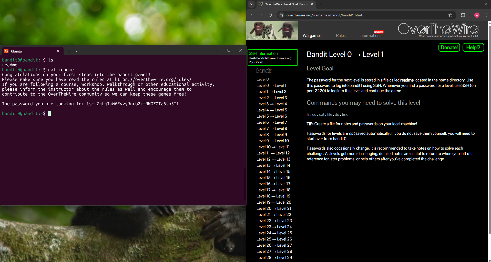

## Bandit Level 0 → Level 1

**Challenge:** Find the password in a file located in the home directory:
- File name: readme
- Location: home directory
- Commands you may use: `ls`,`cd`,`cat`,`file`,`du`,`find`

**Solution:**
```
ls
cat readme
```

**Explanation:**
- `ls` is used to list the files in the current directory.
- When `ls` is ran a file called `readme` is shown.
- Next use the command `cat` with `readme` to print out the contents on the `readme` file
- The password for the next level is displayed in the file


**Password:** ZjLjTmM6FvvyRnrb2rfNWOZOTa6ip5If




**What I learned:** 
- How to list files in a directory using the `ls` command.
- How to view contents of a file using the `cat` command.
- Basic file navigation when working in a terminal enviroment