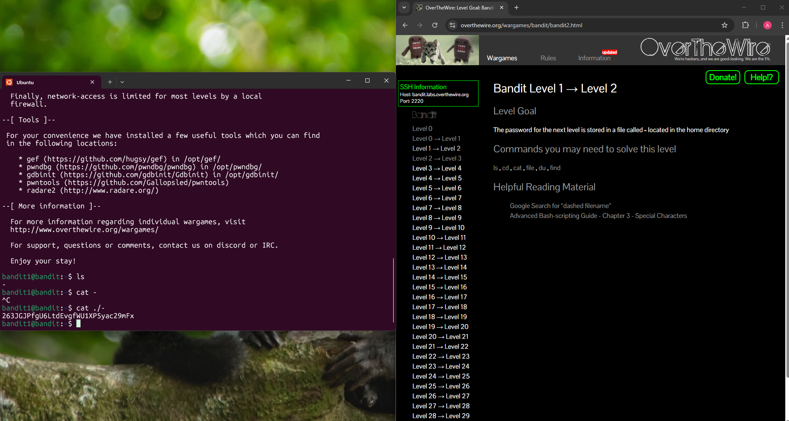

## Bandit Level 1 → Level 2

**Challenge:** Find the password in a file located in the home directory:
- File name: -
- Location: home directory
- Commands you may use: `ls`,`cd`,`cat`,`file`,`du`,`find`

**Solution:**
```
ls
cat ./-
```

**Explanation:**
- `ls` list contents in the current directory. Which shows a file named `-`.
- However when I used the command `cat -`, it interpreted it as standard input instead of a file.
- To reference the file correctly, I specified the current directory (`./`) before the filename.
 

**Password:** 263JGJPfgU6LtdEvgfWU1XP5yac29mFx




**What I learned:** 
- Some filenames may contain special characters that can interfere with commands.
- The best practise is to use `./` before a filename which forces the shell to treat it as a file in the current directory.