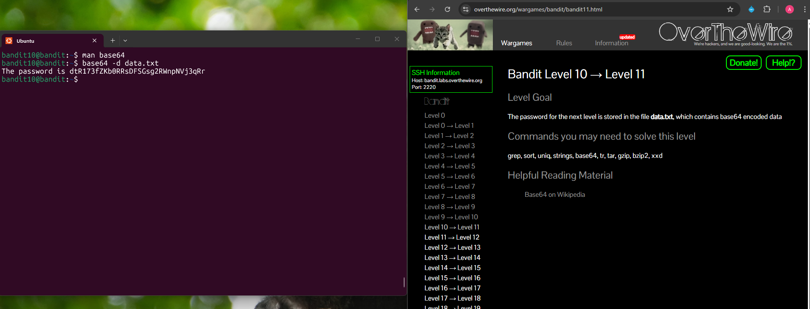

## Bandit Level 10 → Level 11

**Challenge:** Find the password stored in `data.txt`:
- The contents of the file are base64 encoded.
- Explore the base64 command. 


**Solution:**
```
base64 -d data.txt

```

**Explanation:**
- I used `man base64` command to see available options.
- The manual shows that the `-d` flag is used to decode data.
- `base64 -d data.txt` decodes the contents of the file.
- After decoding, the output reveals the password for the next level.


**Password:** dtR173fZKb0RRsDFSGsg2RWnpNVj3qRr





**What I learned:** 
- The `base64` command can both encode and decode data using flags like `-d`.
