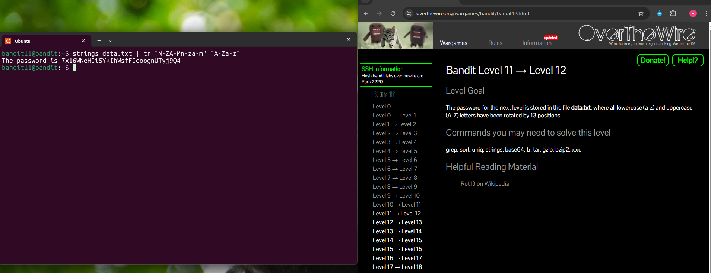

## Bandit Level 11 → Level 12

**Challenge:** The password is store in the data.txt file:
- All letters in the file have been rotated by 13 positions (ROT13 cipher)


**Solution:**
```
strings data.txt | tr "N-ZA-Mn-za-m" "A-Za-z"

```

**Explanation:**
- `strings data.txt` extracts readable text from the file.
- `|` (pipe) passes that output to the next command.
- `tr` is used to translate characters from one set to another.
- `"N-ZA-Mn-za-m"` represents the rotated alphabet used in ROT13.
- `"A-Za-z"` converts the rotated letters back to their original positions.
- After translation, the output reveals the password.

**Password:** 7x16WNeHIi5YkIhWsfFIqoognUTyj9Q4





**What I learned:** 
- The `tr` command can quickly perform character substitution or transformations in the terminal.
