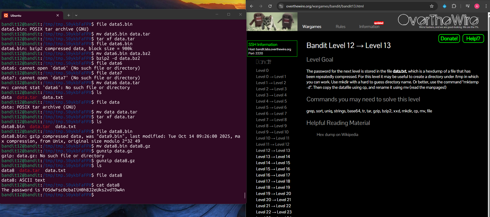

## Bandit Level 12 → Level 13

**Challenge:** Password stored in `data.txt` which is hexdump of another file:
- The original file has been compressed multiple times using different formats.
- Convert the hexdump back to binary and repeatedly extract layers until the password is revealed

**Solution:**
```
mktemp -d
cd /tmp/tmp.xxxxxxx

cp ~/data.txt .

xxd -r data.txt > data
file data

mv data data.gz
gunzip data.gz

mv data data.bz2
bzip2 -d data.bz2

mv data data.gz
gunzip data.gz

mv data data.tar
tar xf data.tar

mv data5.bin data.tar
tar xf data.tar

mv data6.bin data.bz2
bzip2 -d data.bz2

mv data data.tar
tar xf data.tar

mv data8.bin data.gz
gunzip data.gz

cat data8

```

**Explanation:**
- `mktemp -d` creates a temporary working directory in `/tmp`.
- `cp ~/data.txt .` copies the file into the working directory.
- `xxd -r data.txt > data` reverses the hexdump, converting it back into the original binary file.
- `file data` identifies what type of compression is currently applied.
- Depending on the output of `file`, the correct decompression command is used (`gunzip`, `bzip2 -d`, or `tar xf`).
- This process is repeated multiple times until the final file becomes ASCII text containing the password.

**Password:** FO5dwFsc0cbaIiH0h8J2eUks2vdTDwAn





**What I learned:** 
-
-
-