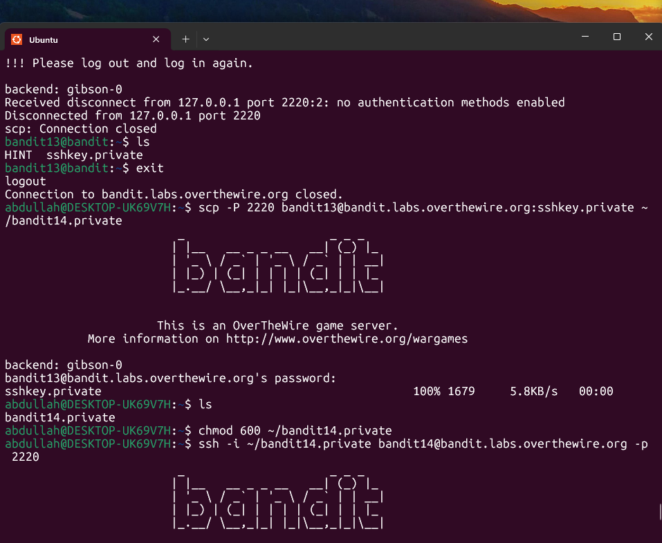
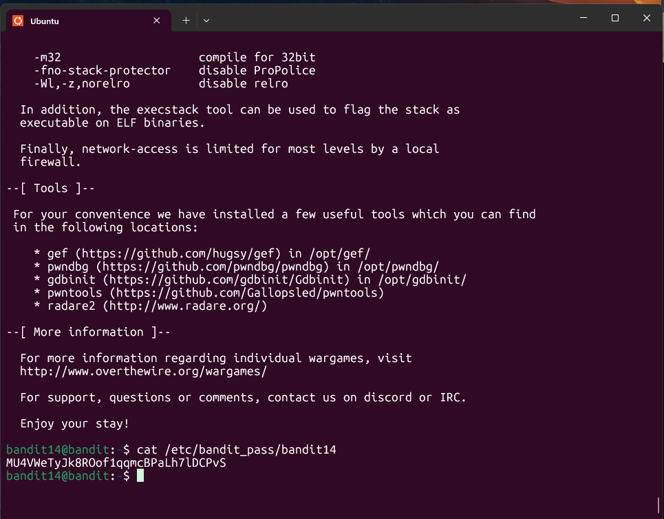

## Bandit Level 13 → Level 14

**Challenge:** Get password with different user:
- The password is stored in `/etc/bandit_pass/bandit14`.
- The file can only be read by user `bandit14`.
- Instead of a password, you are given a private SSH key that allows you to log in as `bandit14`.


**Solution:**
```
ls

scp -P 2220 bandit13@bandit.labs.overthewire.org:sshkey.private ~/bandit14.private

chmod 600 ~/bandit14.private

ssh -i ~/bandit14.private bandit14@bandit.labs.overthewire.org -p 2220

cat /etc/bandit_pass/bandit14

```

**Explanation:**
- `ls` reveals the file `sshkey.private` in the home directory of `bandit13`.
- `scp` securely copies the private key from the remote server to the local machine.
- `chmod 600` restricts permissions so only the owner can read/write the key (SSH requires secure permissions).
- `ssh -i` tells SSH to authenticate using the private key instead of a password.
- Once logged in as `bandit14`, the password file can be read with `cat`.


**Password:** MU4VWeTyJk8ROof1qqmcBPaLh7lDCPvS





**What I learned:** 
- `scp` allows secure file transfers between remote systems and local machines.
- Private SSH keys must have restricted permissions (`chmod 600`) to work properly.
