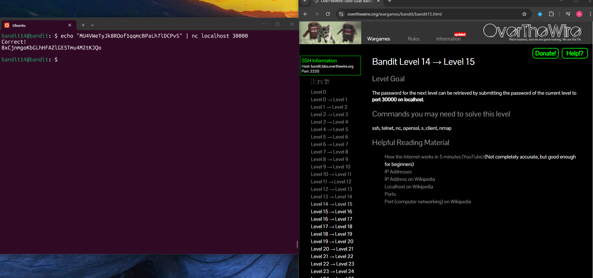

## Bandit Level 14 → Level 15

**Challenge:** Submitting password on port 30000 on localhost:
- The password for the next level is retrieved by submitting the current level’s password to a service running on `port 30000` on `localhost`.
- Use command-line networking tools that can be useful `ssh`, `telnet`, `nc`, `openssl`, `s_client`, `nmap`.

**Solution:**
```
echo "MU4VWeTyJk8ROof1qqmcBPaLh7lDCPvS" | nc localhost 30000


```

**Explanation:**
- `echo "MU4VWeTyJk8ROof1qqmcBPaLh7lDCPvS"` prints the current password to standard output.
- `|` pipes the output of `echo` into the next command.
- `nc localhost 30000` connects to port 30000 on the local machine using `netcat`.
- The output of this command is the password for the next level

**Password:** 8xCjnmgoKbGLhHFAZlGE5Tmu4M2tKJQo





**What I learned:** 

- `nc` (netcat) can be used to interact with TCP/UDP ports on remote or local machines.
- Networking basics like ports and localhost are fundamental for many CTF challenges and real-world troubleshooting.