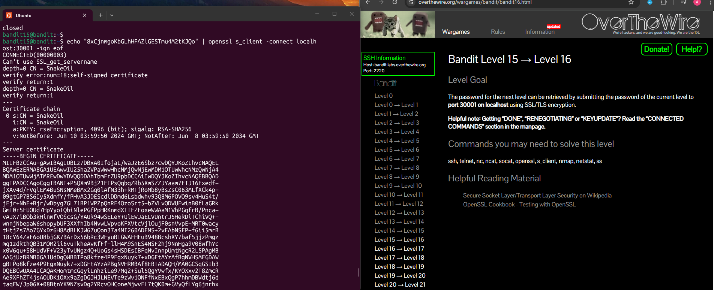
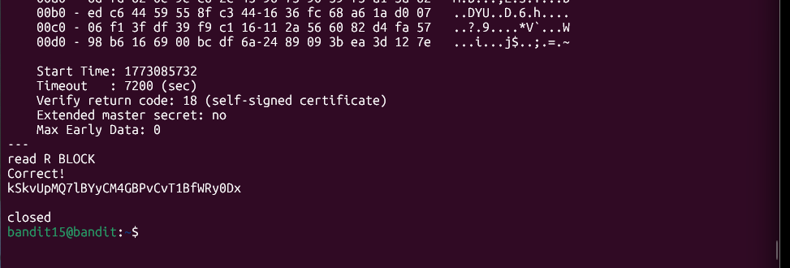

## Bandit Level 15 → Level 16

**Challenge:** Submitting password on port 30001 on localhost usin SSL/TLS:
- The password for the next level is retrieved by submitting the current level password to `port 30001` on `localhost` using `SSL/TLS`.
- You need to use a command-line tool that can handle secure connections, `openssl` and `s_client`.

**Solution:**
```
echo "8xCjnmgoKbGLhHFAZlGE5Tmu4M2tKJQo" | openssl s_client -connect localhost:30001 -ign_eof

```

**Explanation:**
- `echo "8xCjnmgoKbGLhHFAZlGE5Tmu4M2tKJQo"` prints the current password to standard output.
- `|` pipes this output to the next command.
- `openssl s_client -connect localhost:30001` opens a secure SSL/TLS connection to the local service running on port 30001.
- The `-ign_eof` flag ensures that the connection can stay open long enough to recieve a response.


**Password:** kSkvUpMQ7lBYyCM4GBPvCvT1BfWRy0Dx






**What I learned:** 
- SSL/TLS services require special tools (`openssl s_client`) for encrypted communication.
- The `-ign_eof` flag in `openssl s_client` is useful when the server expects multiple requests or needs to take in longer inputs.
