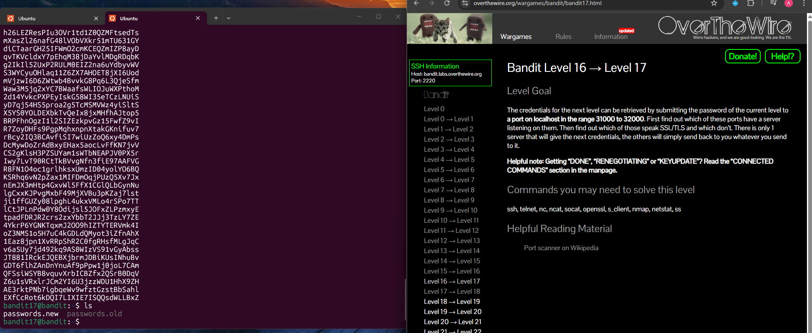

## Bandit Level 16 → Level 17

**Challenge:** Retrieve credentials from a port on a localhost in the range 31000 to 32000:
- The password for the next level must be retrieved by submitting the current level password to a service running on `localhost`.
- The service is running on one port between 31000 and 32000.
- First identify which ports are open, then determine which one uses SSL/TLS and returns the credentials.

**Solution:**
```
nmap localhost -p 31000-32000

ncat --ssl localhost 31790

# Paste the current level password when prompted
# This returns an RSA private key

mktemp -d
cd /tmp/tmp.xxxxxxx

vim private.key

chmod 600 private.key

ssh -i private.key bandit17@bandit.labs.overthewire.org -p 2220

```

**Explanation:**
- `nmap localhost -p 31000-32000` scans all ports in the required range to find which ones have services listening.
- Several ports respond, but only one supports SSL/TLS and returns useful data.
- `ncat --ssl localhost 31790` connects to that port using SSL encryption.
- After submitting the current password, the server returns a private RSA SSH key.
- `mktemp -d` creates a temporary working directory.
- The key is saved locally as `private.key`.
- `chmod 600 private.key` ensures the key has the correct permissions required by SSH.
- `ssh -i private.key bandit17@bandit.labs.overthewire.org -p 2220` logs into the `bandit17` account using the private key.

---

**Password:** (No password is provided for this level — you log in using the private SSH key.)





**What I learned:** 
- `nmap` can be used to scan ranges of ports to find active services.
- Some services require SSL/TLS connections, which can be handled with tools like `ncat --ssl`.
