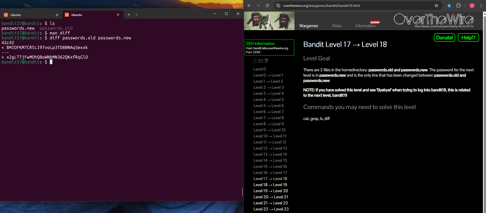

## Bandit Level 17 → Level 18

**Challenge:** Difference of two files:
- There are two files in the home directory: `passwords.old` and `passwords.new`.
- The password for the next level is stored in `passwords.new`.
- It is the only line that is different between the two files.

**Solution:**
```
ls
man diff
diff passwords.old passwords.new

```

**Explanation:**
- `ls` lists the files in the current directory and reveals `passwords.old` and `passwords.new`.
- `man diff` was used to check how the `diff` command works.
- `diff passwords.old passwords.new` compares the two files line-by-line.
- The line beginning with `>` represents the new line in `passwords.new`, which contains the password for the next level.


**Password:** x2gLTTjFwMOhQ8oWNbMN362QKxfRqGlO





**What I learned:** 
- The `diff` command is used to compare two files and show their differences.
