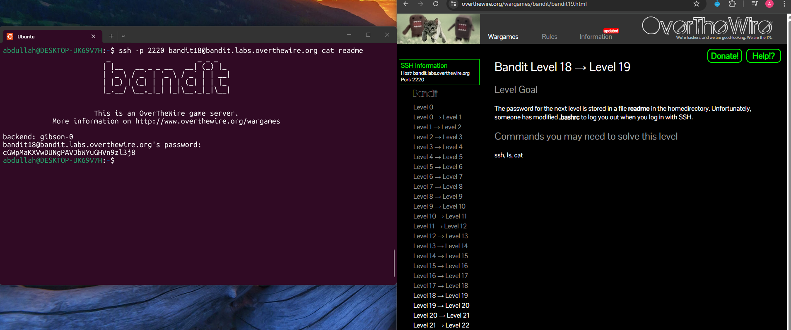

## Bandit Level 18 → Level 19

**Challenge:** Bypassing forced logout via SSH command:
- The password for the next level is stored in a file called `readme` in the home directory.
- The `.bashrc` file has been modified to log you out immediately after login.
- You must find a way to read the file without starting an interactive shell.

**Solution:**
```
ssh -p 2220 bandit18@bandit.labs.overthewire.org cat readme

```

**Explanation:**
- You would normally log in with SSH to start an interactive shell.
- In this level, `.bashrc` is configured to log the user out immediately.
- SSH allows executing a command directly on the remote server during login.
- By adding `cat readme` to the SSH command, the file is read before the logout occurs.
- This bypasses the modified `.bashrc` behavior and prints the password directly.


**Password:** cGWpMaKXVwDUNgPAVJbWYuGHVn9zl3j8





**What I learned:** 
- SSH can execute remote commands directly without opening an interactive shell.
- System startup files like `.bashrc` can be used to control or restrict user sessions.
- Bypassing shell restrictions is sometimes possible by running commands during the SSH connection process.