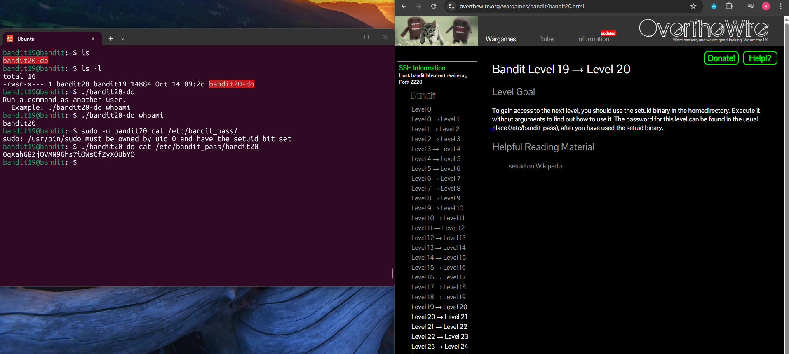

## Bandit Level 19 → Level 20

**Challenge:** Using SetUID Binary to execute commands as another user:
- A setuid binary is located in the home directory.
- It allows you to execute commands as user `bandit20`.
- The password for the next level is stored in `/etc/bandit_pass/bandit20`.

**Solution:**
```
ls
ls -l

./bandit20-do

./bandit20-do whoami

./bandit20-do cat /etc/bandit_pass/bandit20

```

**Explanation:**
- `ls` reveals a binary file called `bandit20-do` in the home directory.
- `ls -l` shows the file permissions, including the setuid bit (`s`).
- The owner of the binary is `bandit20`, meaning commands executed with this binary run as user `bandit20`.
- Running `./bandit20-do` without arguments shows how the program works.
- `./bandit20-do whoami` confirms the command runs as bandit20.
- Since the password file `/etc/bandit_pass/bandit20` is readable only by user `bandit20`, the binary is used to run:
-  `./bandit20-do cat /etc/bandit_pass/bandit20` which prints out the password for the next level.
 

**Password:** 0qXahG8ZjOVMN9Ghs7iOWsCfZyXOUbYO





**What I learned:** 
- The setuid bit (`s`) allows a program to run with the privileges of the file owner instead of the current user.
- Tools like `sudo` may not work in restricted environments, but setuid programs can still provide elevated access.