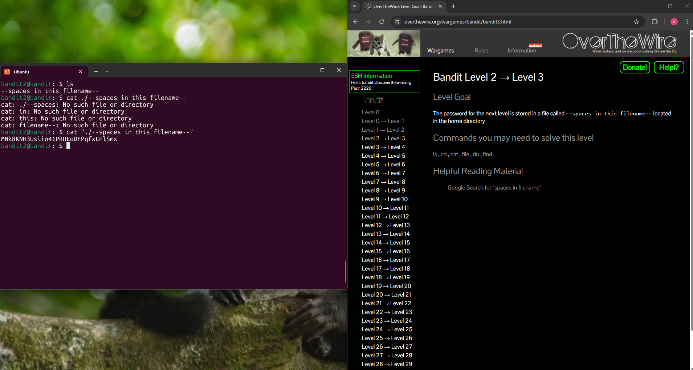

## Bandit Level 2 → Level 3

**Challenge:** Find the password in a file named `--spaces in this filename`:
- Located in the home directory
- The filename contains spaces
- Commands available: `ls`, `cd`, `cat`, `file`, `du`, `find`

**Solution:**
```
ls
cat "./--spaces in this filename--"
```

**Explanation:**
- `ls` lists the file in the current directory named `--spaces in this filename--`.
- At first attempting `cat ./--spaces in this filename--` fails because it is interpreted as separators between arguments.
- Using `cat "./--spaces in this filename--"` in quotes tells the shell to read it exactly as it is written.

**Password:** MNk8KNH3Usiio41PRUEoDFPqfxLPlSmx




**What I learned:** 
- Filenames that contain spaces must be handled differently to other files.
- Quotation marks (`" "`) allow commands to treat the entire filename as a single argument.