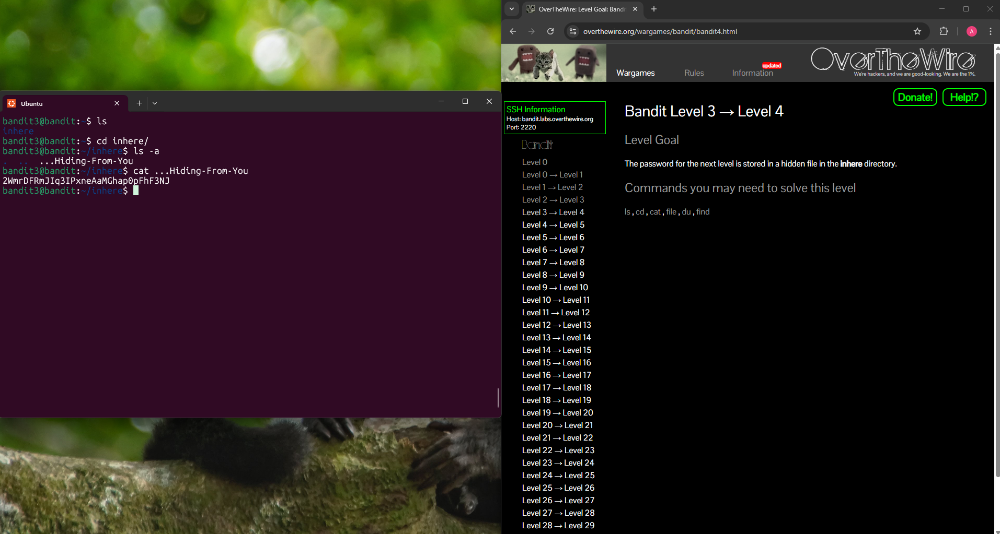

## Bandit Level 3 → Level 4

**Challenge:** Find the password in a file hidden in the directory `inhere`:
- Located in `inhere` directory.
- File name is hidden

**Solution:**
```
ls
cd inhere/
ls -a
cat ...Hiding-From-You

```

**Explanation:**
- `ls` shows that the `inhere` directory.
- `cd inhere/` moves into the directory which contains the hidden file.
- `ls -a` list all files including the hidden ones (the ones that start with a dot `.`).
- This reveals the hidden file ` ...Hiding-From-You`
- `cat ...Hiding-From-You` prints the contents of the hidden files which reveals the password

**Password:** 2WmrDFRmJIq3IPxneAaMGhap0pFhF3NJ




**What I learned:** 
- Hidden files in Linux start with `.` and can't be seen with `ls`.
- `ls -a` is used to discover hidden files.