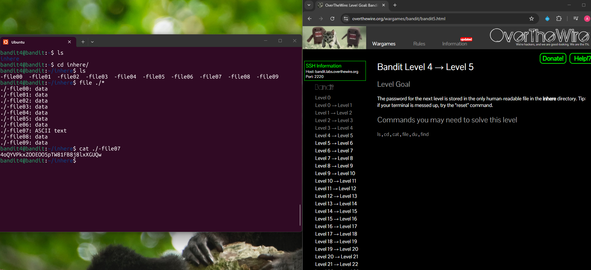

## Bandit Level 4 → Level 5

**Challenge:** Find the password in the only human readable file in the `inhere` directory:
- There are multiple files in the directory
- Only one of the files contains human-readable text

**Solution:**
```
ls
cd inhere/
ls
file ./*
cat ./-file07

```

**Explanation:**
- `ls` shows that the `inhere` directory exists.
- Inside the `inhere` directory there are multiple files starting with `"-file"`
- `file ./*` checks every type of file in the directory to determine which one is human-readable
- One file contains "ASCII text" 
- `cat ./-file07` displays the contents of the file, revealing the password.

**Password:** 4oQYVPkxZOOEOO5pTW81FB8j8lxXGUQw




**What I learned:** 
- You can identify the type of data stored in a file using the `file` command.