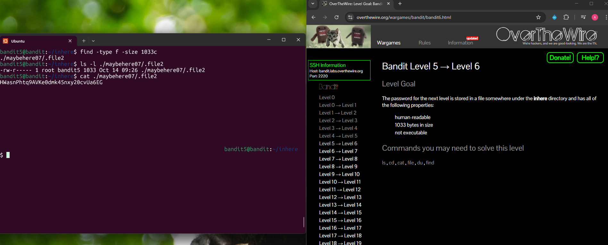

## Bandit Level 5 → Level 6

**Challenge:** Find the password in a file somewhere under the `inhere` directory with the following properties:
- human-readable
- 1033 bytes in size
- not executable

**Solution:**
```
cd inhere
find . -type f -size 1033c
ls -l ./maybehere07/.file2
cat ./maybehere07/.file2

```

**Explanation:**
- `cd inhere` moves into the directory where the files are located.
- `find . -type f -size 1033c` searches for files (`-type f`) that are exactly 1033 bytes in size.
- The command returns `./maybehere07/.file2`, which matches the required size.
- `ls -l` confirms the file permissions and size (1033 bytes and not executable).
- `cat ./maybehere07/.file2` displays the contents of the file, revealing the password.


**Password:** HWasnPhtq9AVKe0dmk45nxy20cvUa6EG





**What I learned:** 
-The `find` command can search for files based on specific properties like size and type.
- The `-size 1033c` flag searches for files that are exactly 1033 bytes.
