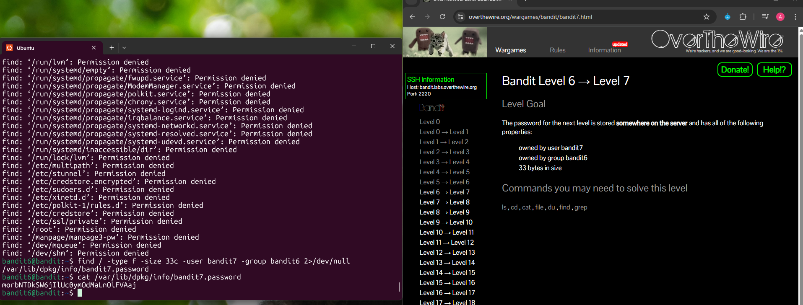

## Bandit Level 6 → Level 7

**Challenge:** Find the password stored somewhere on the server with the following properties:
- Owned by user `bandit7`
- Owned by group `bandit6`
- 33 bytes in size

**Solution:**
```
find / -type f -size 33c -user bandit7 -group bandit6 2>/dev/null
cat /var/lib/dpkg/info/bandit7.password

```

**Explanation:**
- `find /` searches the entire filesystem starting from the root directory.
- `-type f` limits the search to files only.
- `-size 33c` filters files that are exactly 33 bytes in size.
- `-user bandit7` finds files owned by the user `bandit7`.
- `-group bandit6` filters files belonging to the group `bandit6`.
- `2>/dev/null` suppresses "permission denied errors" by redirecting error messages to `/dev/null`.
- The search reveals the file `/var/lib/dpkg/info/bandit7.password`, which contains the password for the next level.


**Password:** morbNTDkSW6jIlUc0ymOdMaLnOlFVAaj





**What I learned:** 
- The `find` command can search the entire system using filters like user, group, and file size.
- `2>/dev/null` is useful for hiding error messages such as "permission denied".
