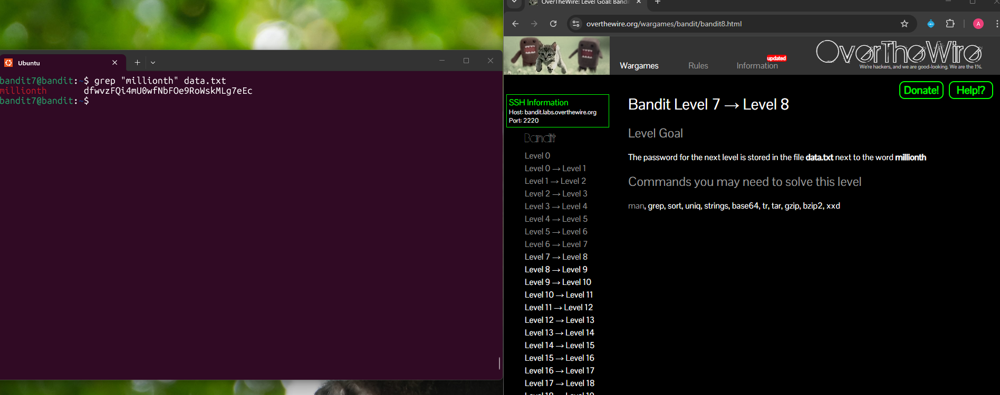

## Bandit Level 7 → Level 8

**Challenge:** Find the password in the file `data.txt`:
- The password is located next to the word "millionth".

**Solution:**
```
grep "millionth" data.txt

```

**Explanation:**
- `grep` is used to search for specific text within a file.
- `"millionth"` is the keyword we are searching for in `data.txt`.
- `grep "millionth" data.txt` scans the file and prints the line containing the word `"millionth"`.
- The output shows the word `millionth` followed by the password.

**Password:** dfwvzFQi4mU0wfNbFOe9RoWskMLg7eEc





**What I learned:** 
- `grep` is useful for searching large files for specific words or patterns.
