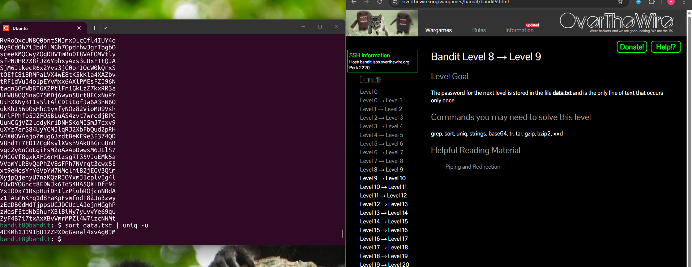

## Bandit Level 8 → Level 9

**Challenge:** Find the password stored in `data.txt`:
- The password is the only line that appears once.
- Other lines appear multiple times
- Use command-line tools to filter duplicate lines

**Solution:**
```
sort data.txt | uniq -u

```

**Explanation:**
- `sort data.txt` sorts all lines in the file alphabetically. This is required because `uniq` only detects duplicates when they are next to each other.
- `|` (pipe) sends the output of the `sort` command to the next command.
- `uniq -u` filters the lines and displays only the lines that appear once in the sorted list.
- Since the password is the only unique line, the command outputs the correct password

**Password:** 4CKMh1JI91bUIZZPXDqGanal4xvAg0JM





**What I learned:** 
- The `sort` command organizes file contents.
- The `uniq` command can filter duplicate lines, and the `-u` flag shows only unique lines.
- Piping (`|`) allows commands to work together by passing the output of one command into another.