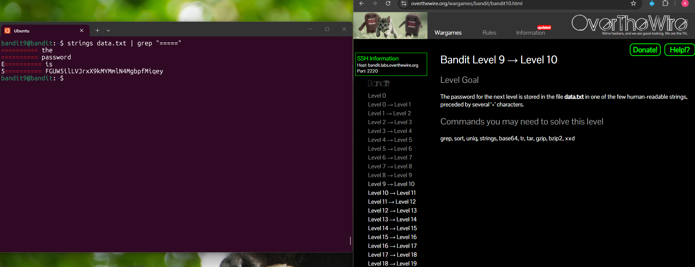

## Bandit Level 9 → Level 10

**Challenge:** Find the password stored in `data.txt`:
- The password is within one of the human-readable strings.
- The password is preceded by several `=` characters.

**Solution:**
```
strings data.txt | grep "====="

```

**Explanation:**
- `strings data.txt` extracts human-readable text from a file that contains unreadable data.
- `|` (pipe) sends the output from `strings` to another command.
- `grep "====="` searches for lines containing multiple `=` characters, as hinted in the challenge.
- The output reveals the line containing the password after several `=` symbols.


**Password:** FGUW5ilLVJrxX9kMYMmlN4MgbpfMiqey





**What I learned:** 
- The `strings` command can extract readable text from binary files.
- Combining `strings` with `grep` makes it easy to locate useful information in large or unreadable files.