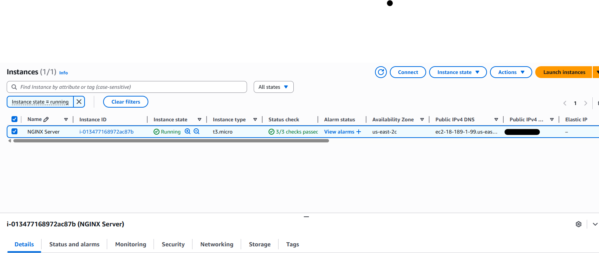
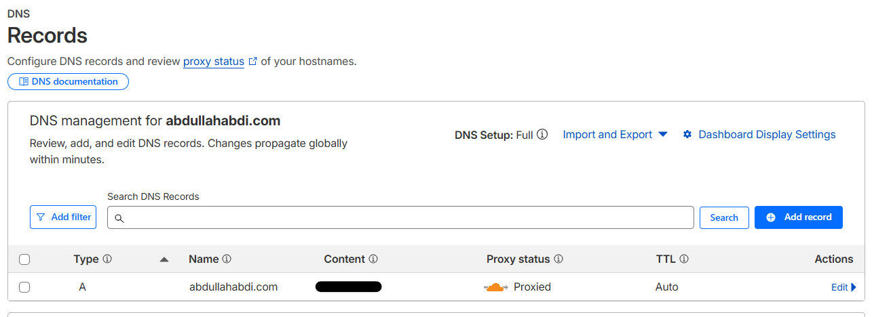
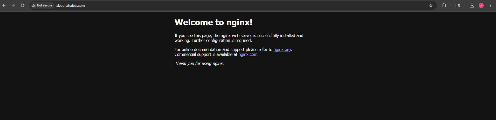

# EC2 + NGINX + Cloudflare 

Deploy a live web server on AWS using EC2 and NGINX, with a custom domain managed through Cloudflare DNS.

---
 
## Project Summary
 
- Registered a custom domain on **Cloudflare**
- Launched a free-tier **EC2 instance** (Amazon Linux, t3.micro)
- Installed and configured **NGINX** as the web server
- Opened ports **80 (HTTP)** and **443 (HTTPS)** via EC2 security group inbound rules
- Pointed `abdullahabdi.com` to the EC2 public IP using a **Cloudflare A record**
- Verified DNS propagation using `nslookup` in the terminal
- Confirmed the live site by visiting the domain in a browser
 
---


## Technologies Used
 
| Tool | Purpose |
|---|---|
| AWS EC2 | Cloud virtual machine |
| NGINX | Web server |
| Cloudflare DNS | Domain management & DNS routing |
| SSH (ed25519) | Secure remote access to the instance |
 
---

 
## Step-by-Step Setup
 
### 1. Register a Domain on Cloudflare
 
Purchase your domain through [Cloudflare Registrar](https://www.cloudflare.com/products/registrar/). Cloudflare offers domains at cost with no markup, and DNS management is built right in.
 
---

### 2. Launch an EC2 Instance
 
In the AWS Console, navigate to **EC2 → Launch Instance** and configure the following:
 
| Setting | Value |
|---|---|
| AMI | Amazon Linux |
| Instance Type | t3.micro |
| Key Pair | ed25519, `.pem` format |
 
**Security Group — Inbound Rules:**
 
| Port | Protocol | Source | Purpose |
|---|---|---|---|
| 22 | TCP | Your IP | SSH access |
| 80 | TCP | 0.0.0.0/0 | HTTP traffic |
| 443 | TCP | 0.0.0.0/0 | HTTPS traffic |
 
Once launched, copy the **Public IPv4 address** from the instance summary — you'll need it in the next step.
 

 
---

### 3. Point Your Domain to EC2 via Cloudflare A Record
 
In your Cloudflare dashboard, go to **DNS → Records → Add Record**:
 
| Field | Value |
|---|---|
| Type | A |
| Name | `@` (root domain) |
| Content | Your EC2 Public IPv4 address |
| Proxy | DNS only (grey cloud) |
 

 
---

### 4. Connect to the Instance via SSH
 
Once your `.pem` key is downloaded, run the connection command provided in the EC2 console under **SSH Client**. It will look like this:
 
```bash
ssh -i "path/to/key.pem" ec2-user@<EC2_PUBLIC_IP>
```
 
> 💡 If your key is in your Downloads folder on Mac/Linux:
> ```bash
> ssh -i "~/Downloads/your-key.pem" ec2-user@<EC2_PUBLIC_IP>
> ```
 
---

### 5. Install NGINX
 
Update the package manager and install NGINX:
 
```bash
sudo yum update -y && sudo yum install nginx -y
```
 
---
 
### 6. Start and Enable the NGINX Service
 
Start NGINX and configure it to launch automatically on reboot:
 
```bash
sudo service nginx start && sudo systemctl enable nginx
```
 
---

### 7. Verify DNS Propagation
 
Run `nslookup` in your terminal to confirm your domain resolves to the EC2 IP:
 
```bash
nslookup abdullahabdi.com
```
 
You should see your **Public IPv4 address** returned alongside your domain name.
 
---

### 8. Visit Your Domain
 
Open a browser and navigate to your domain — the default NGINX welcome page confirms your server is live.
 

 
---

# 🧠 Skills Practiced
 
- Cloud infrastructure provisioning (AWS EC2)
- Linux server administration
- Web server installation and configuration
- DNS management with Cloudflare
- SSH key-based authentication
- Debugging DNS propagation
 
---
 
## 📁 Project Structure
 
```
.
├── README.md
├── setup.sh               # Automated NGINX install & setup script
└── screenshots/
    ├── EC2-instance.png
    ├── cloudflare_record.png
    └── NGINX_Page.png
```
 
---
 
## ⚠️ Cost Note
 
This project uses the **AWS free tier** (750 hrs/month of eligible instance usage). Note that AWS charges ~$0.005/hr for public IPv4 addresses — stop or terminate your instance when not in use to avoid charges.